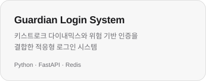
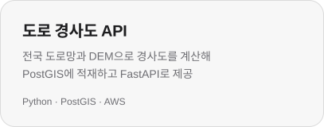
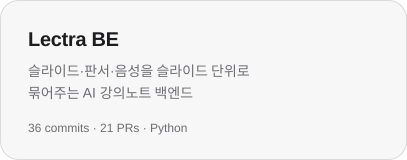
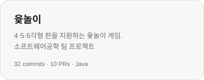
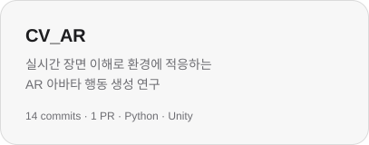
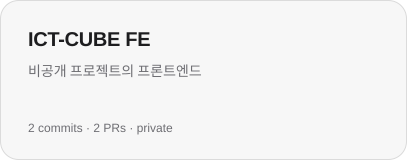
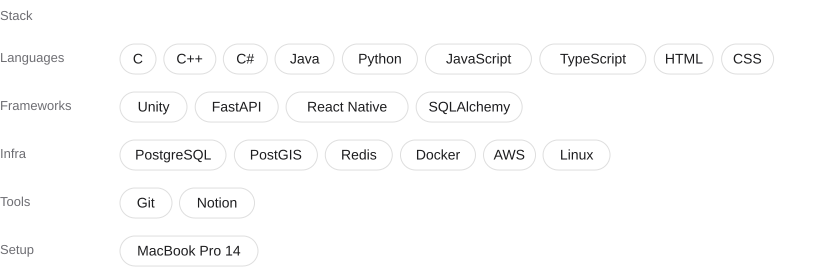
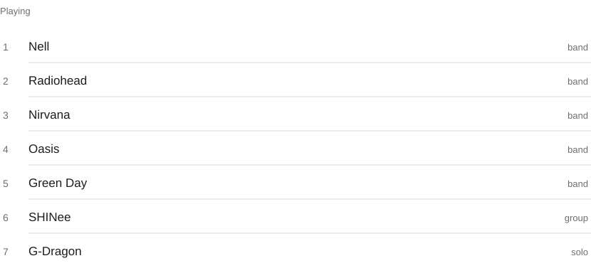
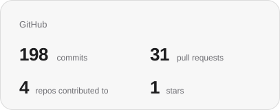
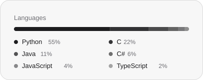

<picture>
  <source media="(prefers-color-scheme: dark)" srcset="assets/header-dark.svg">
  
</picture>

보안과 AR을 공부합니다. 귀여운 강아지 호두를 키우고 있으며 유기견 봉사가 취미입니다.

 

만든 것

  <a href="https://github.com/hs03290811/capstone2"><picture><source media="(prefers-color-scheme: dark)" srcset="assets/card-guardian-dark.svg"></picture></a>
  <a href="https://github.com/hs03290811/capstone"><picture><source media="(prefers-color-scheme: dark)" srcset="assets/card-slope-dark.svg"></picture></a>

  <a href="https://github.com/hs03290811/linux_Team3"><picture><source media="(prefers-color-scheme: dark)" srcset="assets/card-netfilter-dark.svg"></picture></a>

함께 만든 것

  <a href="https://github.com/CAULectra/lectra_BE"><picture><source media="(prefers-color-scheme: dark)" srcset="assets/card-lectra-dark.svg"></picture></a>
  <a href="https://github.com/yeonnnnni/CAU_SWE02_6"><picture><source media="(prefers-color-scheme: dark)" srcset="assets/card-yut-dark.svg"></picture></a>

  <a href="https://github.com/13131323/CV_AR"><picture><source media="(prefers-color-scheme: dark)" srcset="assets/card-cvar-dark.svg"></picture></a>
  <picture><source media="(prefers-color-scheme: dark)" srcset="assets/card-ictcube-dark.svg"></picture>

 

<picture>
  <source media="(prefers-color-scheme: dark)" srcset="assets/stack-dark.svg">
  
</picture>

 

<picture>
  <source media="(prefers-color-scheme: dark)" srcset="assets/music-dark.svg">
  
</picture>

 

  <picture><source media="(prefers-color-scheme: dark)" srcset="assets/stats-dark.svg"></picture>
  <picture><source media="(prefers-color-scheme: dark)" srcset="assets/langs-dark.svg"></picture>

 

song2won@daum.net · peachee@cau.ac.kr

 

가장 친한 친구였던 혜리를 기억하며.
